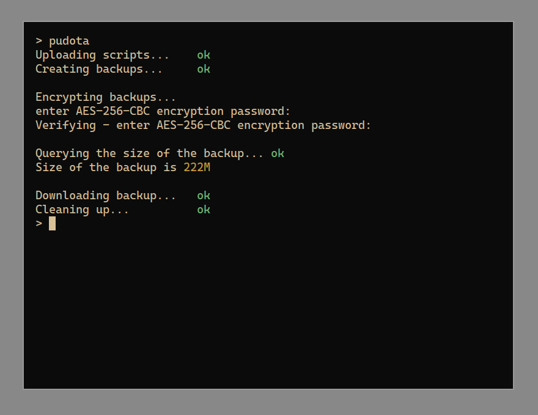

# Pudota

Script which backs up your server using `backup.sh`, encrypts the backup using `encrypt.sh` and then downloads the backup to your computer.

 

## Notes

- SSH-keys are preferred
  - If you choose to not use ssh keys you'll have to enter the password multiple times during the process

- I haven't tested whether this script works if `sudo` asks you for password. In other words, this is only tested to work in an environment with `NOPASS` enabled.
- You should edit the `TARGET_HOST`-environment variable in `pudota.sh`.